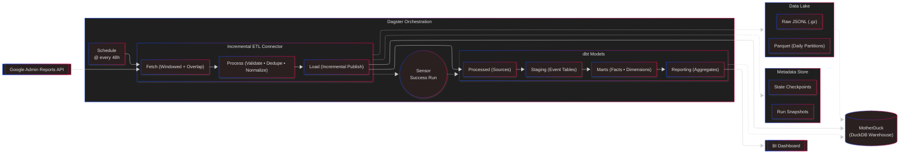

# Google Workspace Security Audit & Analytics Pipeline

This project implements a fully **incremental**, **overlap-safe** pipeline for ingesting and analyzing `Google Workspace Admin Reports` audit activity. It provides reliable end-to-end handling of application events, transforming noisy, latency-prone API responses into structured analytics tables orchestrated through `Dagster` and modeled with `dbt`.


## Background & Overview

- Captures Google Workspace audit events: **token**, **login**, **saml**, **admin**, **drive**.
- Designed for **minimal data loss** while staying easy to run locally.
- Incremental fetchers use **backward overlap** and **per-window chunking** to tolerate late arrivals; raw outputs and **per-run snapshots** are kept under `var/data`.
- Light transforms **deduplicate** and **normalize** events into Parquet.
- Incremental loader pushes processed data into **DuckDB/MotherDuck** for downstream analytics.
- **Dagster** orchestrates the full lifecycle—ingestion → processing → loading—then triggers **dbt** to build incremental staging, fact, and mart models as soon as new data lands.


## Highlights

- **Stateful cursors per app** stored in `var/state` with configurable backward overlap; safe to re-run windows or resume after failure.
- **Partitioned storage layout** (defaults to repo-local `var/data` so artifacts stay contained; override via env if desired):
  - Raw JSONL by date/hour
  - Per-run snapshots
  - Processed Parquet by date  
  with optional gzip compression.
- **Polars transforms** include scope explosion for token events to keep data models lean.
- **Incremental DuckDB/MotherDuck loader** rewinds the cursor by `GWS_BACKWARD_OVERLAP_MINUTES` to stay idempotent while updating `processed` schema tables.
- **dbt project** `gws_audit_analyzer` builds staging and marts on top of the loaded tables; a **Dagster sensor** triggers it after successful ingestion.
- **Rich logging** in `var/logs/gws-activity-analyzer.log` and Dagster event logs -- use these for up-to-date timings and row counts instead of static benchmarks.

## Project Architecture

### A High Level View


## Pipeline Stages

### 1. Ingestion (`raw_fetch`)
* Google Admin Reports API fetchers for each app: `TOKEN`, `login`, `saml`, `admin`, `drive`.
* For each run:
  * Chunk the time range into windows and run them in parallel (per app).
  * Write window-indexed raw JSONL (optionally gzipped) as `part(_HH)(_w<window_index>).jsonl.(gz)` under the configured raw data directory (default: `var/data/raw/<app>/<YYYY-MM-DD>/...`).
  * If `GWS_WRITE_SNAPSHOT` is enabled, emit per-run metadata as `snapshot_<RUN_ID>.json` under `var/data/runs_snapshots/<app>/`.

### 2. Processing (`light_transform`)
* **Polars-based** transforms:
  * Deduplicate events.
  * Enforce the **recent window** (e.g., last 48 hours).
  * Normalize schemas and explode scopes for token events.
* Outputs:
  * `var/data/processed/<app>/events_YYYY-MM-DD.parquet`
  * `var/data/processed/token/event_scopes_YYYY-MM-DD.parquet` (for `fact_token_scope`)

### 3. Warehouse Publish (`warehouse_publish`)
* Incremental loader:
  * Reads processed Parquet from `var/data/processed`.
  * Writes into **DuckDB/MotherDuck** schema `processed`.
  * Rewinds the cursor by `GWS_BACKWARD_OVERLAP_MINUTES` for idempotent retries.
* Target database and connection are configured via `.env`.

### 4. Analytics
* **dbt project** `gws_audit_analyzer`:
  * Builds **staging** models and **marts** (e.g., `fact_token_scope`, event-level facts).
  * Can be:
    * Triggered by a Dagster sensor after successful ingestion.
    * Run manually via dbt CLI.

### 5. Utilities
* Helper scripts under `scripts/` for:
  * Scope collection.
  * Overlap estimation / lateness measurement.
  * Cleanup and reset.

## Setup

### 1. Create a Virtual Environment

From the `gws-pipeline` directory:

```bash
cd gws-pipeline
uv sync
```

### 2. Credentials

* Place the **Google Workspace service account key** (with domain-wide delegation) at the **repo root** as:

```text
creds.json
```

### 3. Configure `.env` (repo root)

Settings are loaded with the `GWS_` prefix. Key options:

| Variable | Required | Default | Purpose |
| --- | --- | --- | --- |
| `GWS_SUBJECT` | Yes | - | Super-admin email used for domain-wide delegation. |
| `GWS_CREDS_FILE` | Yes | `creds.json` | Path to the Google Workspace service account key. |
| `GWS_MOTHERDUCK_TOKEN` | Yes | - | MotherDuck auth token for `md:` connections. |
| `GWS_MOTHERDUCK_DB_NAME` | Yes | - | MotherDuck database name. |
| `GWS_BACKWARD_OVERLAP_MINUTES` | No | `3` | Minutes to rewind cursors for safe retries/backfill. |
| `GWS_DEFAULT_DELTA_HRS` | No | `48` | Hours of history to fetch on first run when no state exists. |
| `GWS_WINDOW_HOURS` | No | `6` | Fallback fetch window size (per-app overrides apply). |
| `GWS_MAX_PARALLEL_WINDOWS` | No | `4` | Max concurrent windows per app during fetch. |
| `GWS_PROCESS_BATCH_DAYS` | No | `2` | Number of days processed per batch when writing Parquet. |
| `GWS_USE_GZIP` | No | `False` | Compress raw JSONL outputs. |
| `GWS_GZIP_COMPRESSION_LVL` | No | `5` | Gzip compression level when `GWS_USE_GZIP=True`. |
| `GWS_WRITE_SNAPSHOT` | No | `True` | Emit per-run snapshot metadata files. |
| `GWS_DUCKDB_LOADER_SCHEMA` | No | `processed` | Target schema for DuckDB/MotherDuck loader. |
| `GWS_BASE_URL` | No | `https://www.googleapis.com` | Base URL for the Reports API. |

> [!NOTE]
> Buffer / window settings and paths default to `var/...` under the repo; override via env vars if needed.

### 4. (Optional) Dagster UI

```bash
cd gws-pipeline
uv run dg dev
```

Then open:

```text
http://localhost:3000
```

## Running

### End-to-End Ingestion (fetch -> process -> load)

```bash
cd gws-pipeline
uv run dagster job execute -m gws_pipeline.definitions -j gws_ingestion_job
```

### Build Analytics Models (dbt via Dagster)

```bash
cd gws-pipeline
uv run dagster job execute -m gws_pipeline.definitions -j job_build_dbt_models
```

* Sensor `trigger_dbt_build_models_after_ingestion` runs this automatically after successful ingestion.

## Reset

Clears pipeline artifacts (**logs**, **state**, **data**) while leaving code and configuration intact.

Run from the repo root:

```bash
cd gws-pipeline
uv run python scripts/reset.py
```

## Authors
[Kayvan Shah](https://github.com/KayvanShah1) | `MS in Applied Data Science` | `USC`

## License

This repository is licensed under the **MIT License**. See the `LICENSE` file for details.

<sub>
Disclaimer: The content and code provided in this repository are for educational and demonstrative purposes only. The project may contain experimental features, and the code might not be optimized for production environments. The authors and contributors are not liable for any misuse, damages, or risks associated with the use of this code. Users are advised to review, test, and modify the code to suit their specific use cases and requirements. By using any part of this project, you agree to these terms.
</sub>
```
