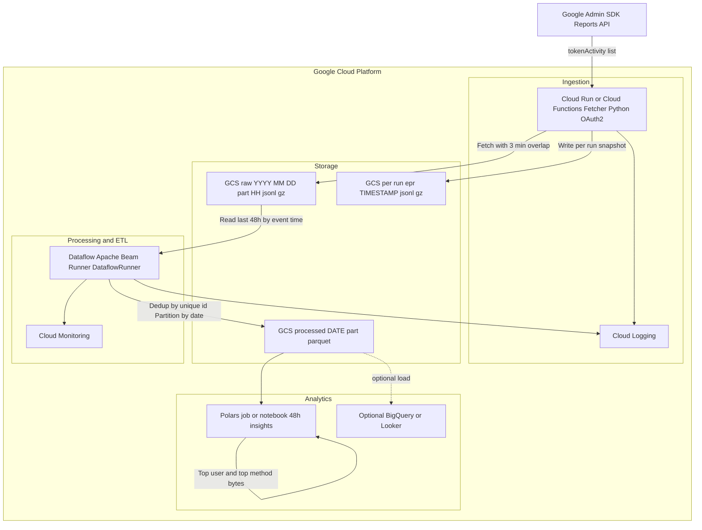
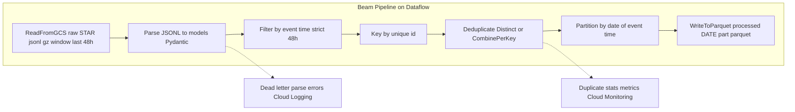

# Google Workspace Token Activity Analyzer

A robust data pipeline to **fetch**, **process**, and **analyze** token activity events from the `Google Workspace Admin Reports API`. This project ensures no data loss across multiple runs and provides insight into API usage patterns.

## Overview

This project is designed to:

1. **Fetch** token activity events using `Google Admin SDK Reports API`.
2. **Buffer and persist** these events in *time-partitioned* `JSONL` files.
3. **Process and deduplicate** the events using **Apache Beam** and store them in optimized Parquet format.
4. **Analyze** recent activity (last `48` hours) using **Polars** to answer key questions:
   * Who generated the most events?
   * Which API method returned the most bytes?

## Project Architecture

### Pipeline Architecture
```bash
📡 Google Admin API → 🧩 Fetcher → 📂 Raw JSONL / 📝 Per-Run Logs → 🛠️ Apache Beam → 🧱 Parquet Files → 🔍 Polars → 📊 Final Insights
```


### 1. **Fetcher**

* Uses Google's Admin Reports API to retrieve `token` activity events.
* Adds a **3-minute overlap** between runs to avoid data loss due to delays in API event delivery.
* Partitions and stores events by:
  * `YYYY-MM-DD/part_HH.jsonl(.gz)`
* Each fetch run also produces a dedicated `.jsonl(.gz)` file capturing all events retrieved during that run. This file serves as a:
    * Complete snapshot of raw API responses for the run (unfiltered, unpartitioned, and undeduplicated).
    * One file per run, named using `ISO-style UTC` timestamps (e.g., `epr_2025-05-30T15-00-00Z.jsonl.gz`). `epr` stands for `Events per run`.
    * This file is not used in the processing pipeline; it's retained strictly for audit and debugging.

### 2. **Processor**

* Built with **Apache Beam** (DirectRunner).
* Reads compressed raw files from the last 48 hours (based on last-run timestamp).
* Deduplicates records using the `unique_id` field.
* Converts and writes partitioned **Parquet files** (one per day).

### 3. **Analyzer**

* Uses **Polars** for fast DataFrame operations.
* Reads recent Parquet files (last 48 hours).
* Filters events strictly by timestamp.
* Computes:
  * **Top user** by event count.
  * **Top method_name** by total bytes returned.
 
### Pipeline with DataFlow Runner portable to SparkRunner


## Design problems

### How to choose the right minute-overlap (to avoid missing late events)?

**Short answer:** measure real lateness from your own runs, then set overlap to the high-percentile delay plus a small safety pad (e.g., +1–2 min).

**Data-driven, iterative method (N-run approach):**

1. **Run N jobs without overlap** (e.g., hourly, N≈10). Each run *i* queries `[start_i, end_i]` and emits a **per-run** JSONL snapshot (`epr_…jsonl.gz`).
2. For each run *i*, compute:

   * `min_event_i` = min `event_time` in that run’s snapshot
   * `max_event_i` = max `event_time` in that run’s snapshot
3. Compute *clipped* gaps (always non-negative):

   * **early\_gap\_i** = `max(0, start_i - min_event_i)`  → how far **back** late events arrived
   * **late\_gap\_i**  = `max(0, max_event_i - end_i)`   → how far **past** the window events extend
4. Your **backward overlap** should cover late arrivals:

   * `overlap_minutes = ceil( percentile(early_gap, 95) ) + safety_pad_minutes`
   * Use 95–99th percentile for stability; set `safety_pad_minutes` to 1–2.
5. (Optional) If you also want a **forward guard band** (rarely needed), add `ceil(percentile(late_gap, 95))`.

> If you don’t have history yet, use **3–5 minutes**. After a few days, recompute the percentile and tighten/loosen as needed.


## Assumptions & Safeguards

* No real-time guarantees from the API. Events may arrive late or out of order.
* A **time-based overlap** ensures reliable fetching across runs.
* Deduplication is based on `unique_id` to prevent duplicate counting.
* Processing logic is based on **event time**, not fetch time, to align with actual user activity.
* Only events from the **last 48 hours (from last run)** are processed and analyzed.
---

## Folder Structure

```bash
.
├── data/
│   ├── raw/            # Time-partitioned raw JSONL files
│   ├── processed/      # Parquet files (partitioned by event date)
│   └── per_run/        # Per-run logs in JSONL format
├── config.py           # App settings and logger
├── fetcher.py          # Fetches token activity from API
├── process.py          # Apache Beam ETL pipeline
├── analyze.py          # Polars-based analytics
├── models.py           # Pydantic models for parsing
└── utils.py            # Common utilities (e.g., recent file resolver)
```
---

## Performance Metrics & Device Specs

This section documents how the pipeline performs in practice and the environment it was tested on. Helps as a baseline for future optimization or portability.

### Pipeline Performance (Batch of \~500K records)

| Stage                    | Time Taken  |
| ------------------------ | ----------- |
| Fetch + Write JSONL      | \~12-15 min    |
| Beam Transform + Parquet | \~1.5 min |
| Ad-hoc Polars Analysis   | < 3 sec     |

### Volume Stats

| Metric                  | Value (approx) |
| ----------------------- | -------------- |
| Events Fetched (48 hrs) | \~500,000      |
| JSONL Files Created     | 48 (hourly)    |
| Per-run JSONL Log Size  | 3-12 MB each   |
| Daily Parquet Size      | \~6-8 MB/day |
| Compression ratio | \~56% (12 MB -> 7 MB)|
| Throughput | \~5,600 records/sec |

### Local Device Specs

| Component      | Detail                               |
| -------------- | ------------------------------------ |
| Device | HP Pavilion x360 |
| CPU            | Intel(R) Core(TM) i7-10510U CPU @ 1.80 GHz 2.30 GHz (8 cores) |
| RAM            | 32 GB DDR4                           |
| Disk           | SSD (NVMe)                           |
| OS             | Windows 11 + WSL 2                   |
| Python Version | 3.12.9                               |

---

## 🛠️ Setup Instructions

### 1. Extract Assignment Files

```bash
cd input
base64 --decode takehomeb64.txt > takehome.zip
unzip takehome.zip -d takehome
```
> Copy the `creds.json` file and paste it into the root folder of the project

### 2. Create Python Environment
> Come back to the root folder
```bash
uv sync
```
OR
```bash
python -m venv .venv
source .venv/bin/activate
pip install -r requirements.txt
```

### 3. Configure Environment

Update the following in your `config.py` or `.env` (depending on your setup):

* `creds_file`: Path to your GCP service account key.
* `subject`: GSuite super admin email.
* `base_url`: Google Reports API base URL.
* `data_dir`, `log_dir`, `state_file_fetcher`: Paths for storing artifacts and logs.

A sample Environment file (`.example.env`)
```
GWS_SUBJECT=firstname.lastname@domain.com
GWS_BUFFER_SIZE=5000
GWS_PER_RUN_BUFFER_SIZE=2500
GWS_DEFAULT_DATE_FORMAT=%Y-%m-%dT%H:%M:%S%z
GWS_DEFAULT_DELTA_HRS=48
GWS_OVERLAP_MINUTES=3
GWS_USE_GZIP=True
GWS_GZIP_COMPRESSION_LVL=6
```

## Run Instructions
- Run programs from the **ROOT** folder of the project

### Step 1: Fetch Activity Data

```bash
python fetcher.py
```

> Pulls token activity from the last run timestamp up to now, with overlap protection.

### Step 2: Process the Raw Data

```bash
python process.py
```

> Deduplicates and partitions data into Parquet files.

### Step 3: Run Analysis

```bash
python analyze.py
```

Outputs:
- Top user by event count
- Top API method by total bytes returned

### [DANGER] Complete data `RESET`
```bash
python reset.py
```

## 📈 Example Output

```bash
User with most events: 
{'user': 'nancy.admin@hyenacapital.net', 'profile_id': '100230688039070881323', 'count': 401122}

Top API by data returned: 
{'method_name': 'reports.activities.list', 'total_bytes': 38805605490}
```
---

## Authors
1. [Kayvan Shah](https://github.com/KayvanShah1) | `MS in Applied Data Science` | `USC`

#### LICENSE
This repository is licensed under the `MIT` License. See the [LICENSE](LICENSE) file for details.


<sub>
Disclaimer: The content and code provided in this repository are for educational and demonstrative purposes only. The project may contain experimental features, and the code might not be optimized for production environments. The authors and contributors are not liable for any misuse, damages, or risks associated with the use of this code. Users are advised to review, test, and modify the code to suit their specific use cases and requirements. By using any part of this project, you agree to these terms.
</sub>
